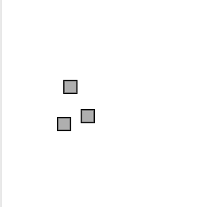

# Physics libraries

“A library implies an act of faith/Which generations still in darkness hid/Sign in their night in witness of the dawn.”
— Victor Hugo

Uses JBox2D code which is specific to Java.

The alternatives to try are matter.js or this sketch here:
<https://editor.p5js.org/javier/sketches/wzLQrzS0t>

<https://editor.p5js.org/javier/sketches/wzLQrzS0t>

But apparently we have this from noc: 

``

``

Also check this: 
<https://github.com/nature-of-code/noc-examples-p5.js/tree/master/chp05_libraries/box2d-html5/NOC_5_01_exercise_solve

This sketch solves the problem 5.2. SO lets start the chapter from there.

problem is converting this to box2d :

The solution after using the libraries :
