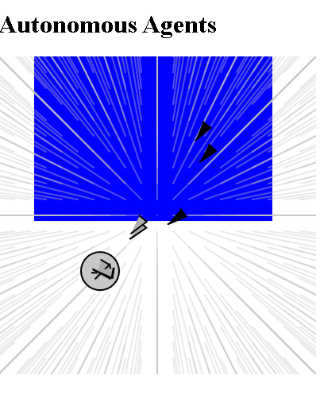
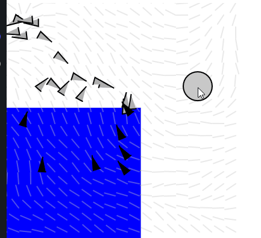

# autonomous agents

“This is an exercise in fictional science, or science fiction, if you like that
better.”
— Valentino Braitenberg

## basic steering behaviour

Till ex6.6 : Creating a central vector flowfield

following the flow path just before ex6.7

## further ideas

1. create more means of locomotion: like shuffling feet etc.

live at : https://editor.p5js.org/fanbyprinciple/full/5o7rJCrst