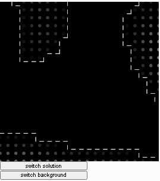

## Marching Squares with square contours

Made with reference to the Coding in the Cabana series, by the Coding train !

reference - https://www.youtube.com/watch?v=0ZONMNUKTfU

My contribution -

1. Using square contours in p5.js

In using this I drew the boundaries from center of square to the edge.

2. Using for loops instead of switch 
Because you know, I like torturing myself.

live at - https://editor.p5js.org/fanbyprinciple/present/irH3GxBi3

