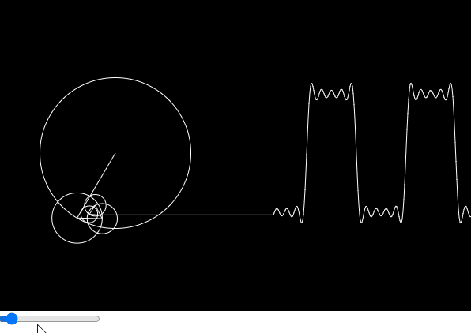

# Fourier transform

Addign together two waves to create a new wave, we can use fourier transform to filter out the wave

fourier series is for periodic signals and fourier transform is for aperiodic signals

