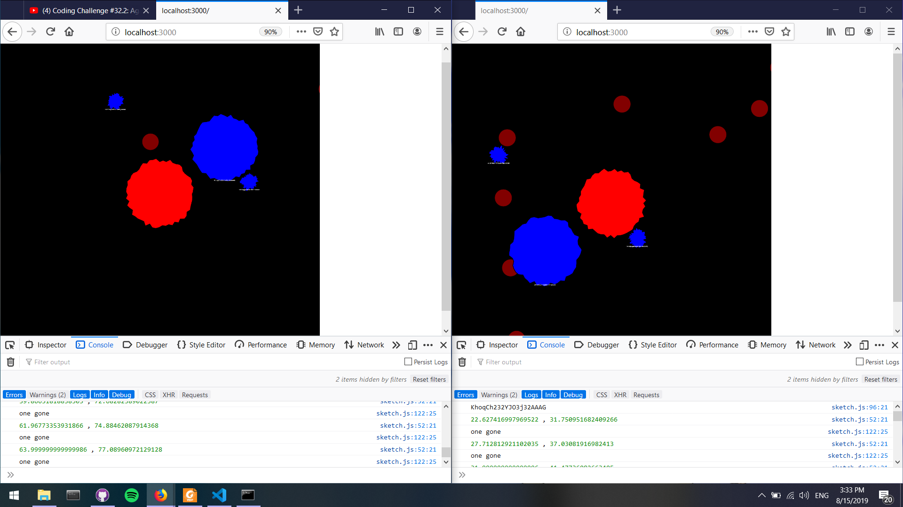

### Haemaglobin

## An agar io like game, where you red blood cell is out for..well blood.

Right now there is socket connectivity between two instances running on seperate browser window.
to do:
    1. make them gobble each other
    2. add color to distinguish
    3. add a name to each globin

