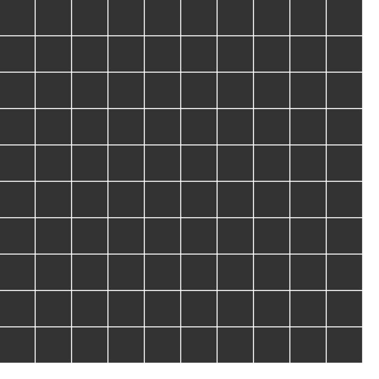
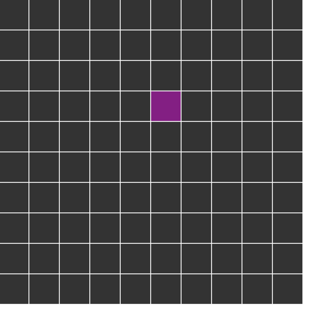
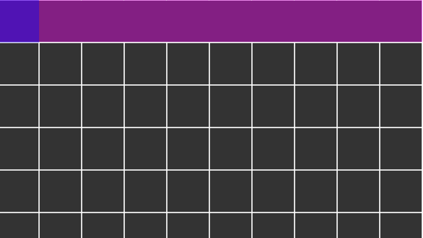

# Maze generator

The concept of recursive backtracking:
https://en.wikipedia.org/wiki/Maze_generation_algorithm#Recursive_backtracker

The coding train youtube video:
https://www.youtube.com/watch?v=HyK_Q5rrcr4

## Part 1 : Creating a grid

## Part 2 : Problem with grid stepping

It only takes right a valid boundary

