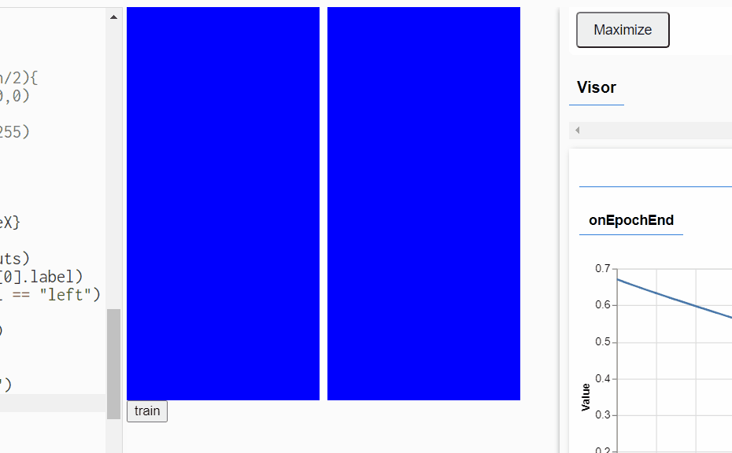

# Mice Learning

Implementing Neural network through mouse movements,
coding train channel Dan Shiffman

https://www.youtube.com/watch?v=Z3n1mLirnww

## Implementing left and right classifier

code live at: https://editor.p5js.org/Ajmcking/sketches/hf8KqB_0Q

## Implementing generic classifier

at video timestamp 1:15.26

https://editor.p5js.org/Ajmcking/sketches/hf8KqB_0Q

finding error:

