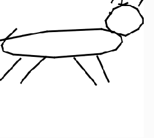

# Quick cat drawings

I am just using shiffmans created api

creating my own express server to host the ndjson file got from quick draw here: https://console.cloud.google.com/storage/browser/quickdraw_dataset/full/simplified;tab=objects?pli=1&prefix=pig&forceOnObjectsSortingFiltering=false&pageState=(%22StorageObjectListTable%22:(%22f%22:%22%255B%257B_22k_22_3A_22_22_2C_22t_22_3A10_2C_22v_22_3A_22_5C_22pig_5C_22_22%257D%255D%22))

Converting that into array in p5 sketch we have:

loading a bowtie instead

Continue from : https://thecodingtrain.com/CodingChallenges/122.1-quick-draw.html

22 min