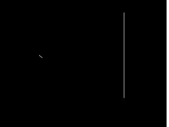

# Raycasting 2D

Simple explanation:

    We need two objects 
    a ray and a boundary
    and answer two questions willthe ray hit the boundary ?
    If yes where?

Ray detection:

Ray detection and casting on all walls:

