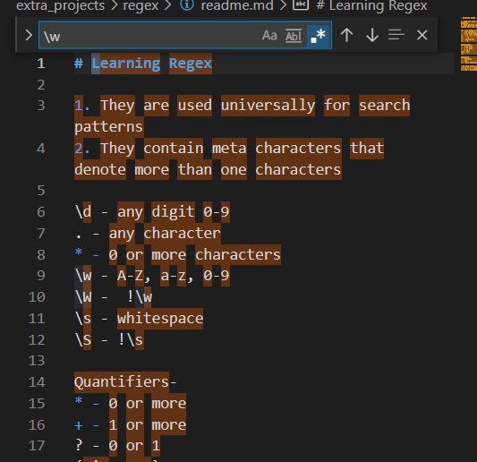
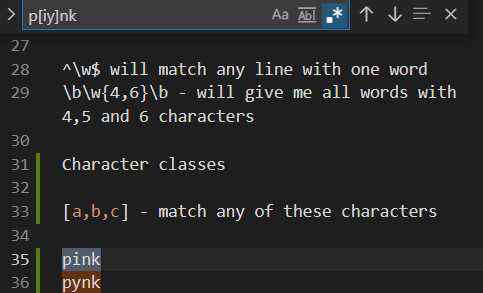
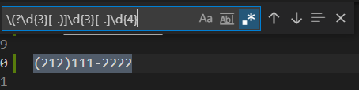
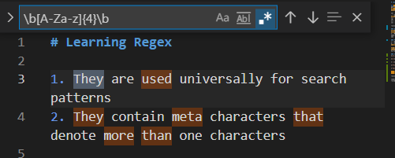
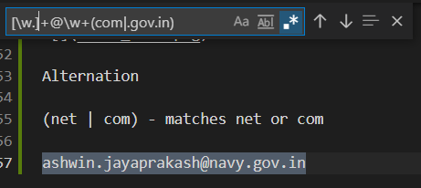
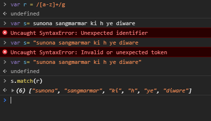

# Learning Regex

Wonderful reference: https://shiffman.net/a2z/regex/

1. They are used universally for search patterns
2. They contain meta characters that denote more than one characters

\d - any digit 0-9
. - any character
* - 0 or more characters
\w - A-Z, a-z, 0-9 
\W -  !\w
\s - whitespace
\S - !\s

### Quantifiers-
* - 0 or more
+ - 1 or more
? - 0 or 1
{min, max}
{n}

### Positions-
^ - begining
$ - end
\b - word beginning

^\w$ will match any line with one word
\b\w{4,6}\b - will give me all words with 4,5 and 6 characters

### Character classes -
[a,b,c] - match any of these characters

[a-z] a through z

[-.{] - or . or{

[s^bc] s or b and c

[^sbc] not s b c

pink
pynk

(212)111-2222

matching any four letter word with characteres in it

Alternation

(net | com) - matches net or com

ashwin.jayaprakash@navy.gov.in

ashwin jayaprakash
ashish jyaparakash

Back references:

\b(\w+)\s\1\b

1 refers tothe group

test() and match()

new RgExp(" ")
new Strg(" ")

var s = "hello"

regularExp.test(string)
string.test(regularExp)

\b - word boundary

/g is a flag to look at the expression multiple times
/i for flagging case insensitive

next : https://www.youtube.com/watch?v=t029QcVHtas&list=PLRqwX-V7Uu6YEypLuls7iidwHMdCM6o2w&index=7