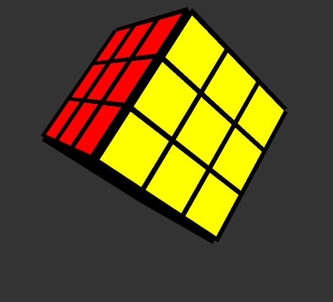

# Rubik cube

I have run into a problem in p5.js that is I am unable to access individual faces of the box function.

Cant use Quad function either as that is yet to be implemented in WEBGL.

# Starting with the given p5 implementation by the coding train

It use p5.createEasyCam() to deal with rotation of cube. Looks promising.

It uses class Cubie.js
and the file new_sketch.js

