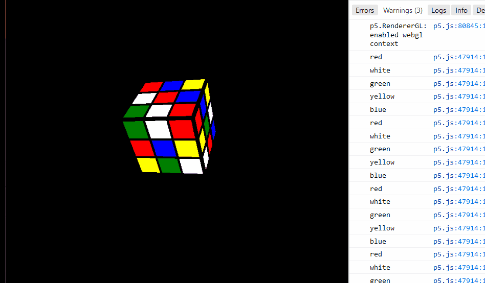

### Worlds hardest to solve rubik cube, me thinks

I have run into a problem in p5.js that is I am unable to access individual faces of the box function.

Cant use Quad function either as that is yet to be implemented in WEBGL.

