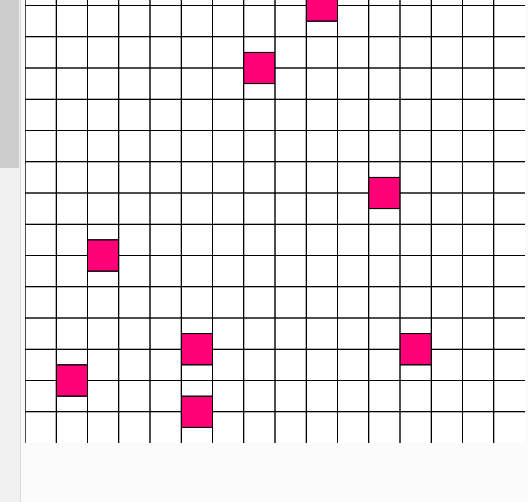
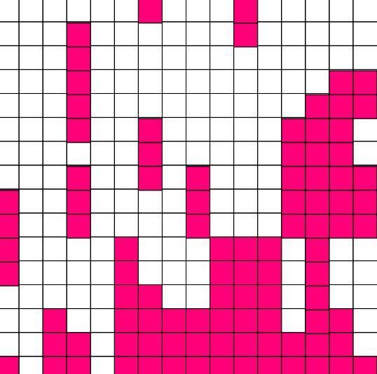

# Tetris 2020

Need basic physics XD

Pieces falling down:

Pieces on top of each other and movement of blocks to left and right:

But need to change approach now, 
1. consider square active to be a property of entire grid for better control.
2. make clear line control

p5. editor at:
https://editor.p5js.org/fanbyprinciple/sketches/7oUO3Yj_R