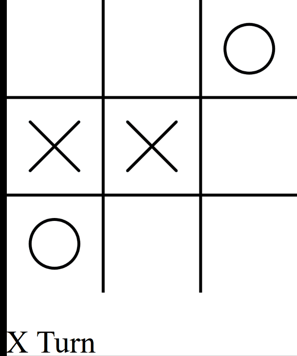
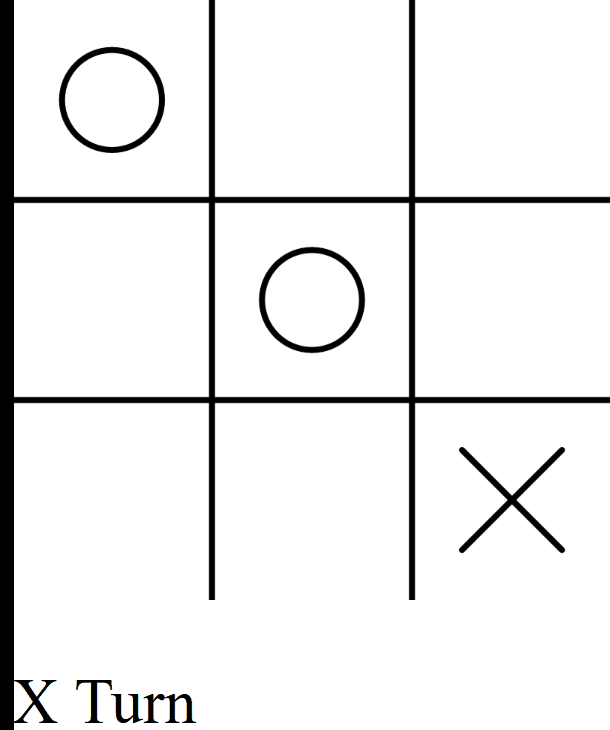

# Tic tac toe
The bland uggh boring game.

## auto tic tac

# human ai tictac

### minmax algorithm
>choosing the optimal node for immediate child node and then alternatting for adversary.

cant seem to point where the bug is but sketch.js contains my code
player_vs_minimax.js is shiffmans code

my implementation of min max is still infuriatingly dumb.

