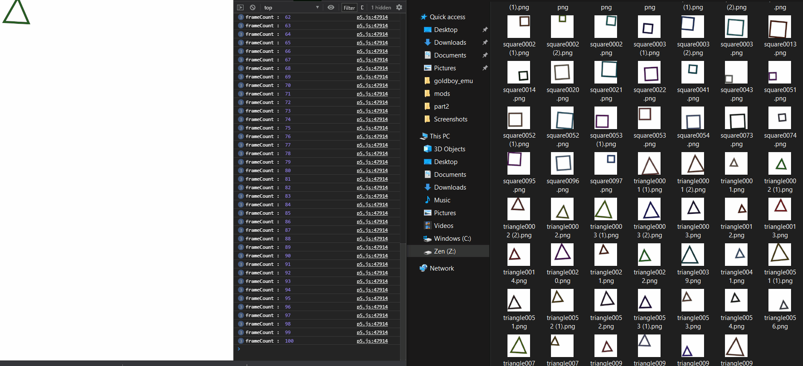
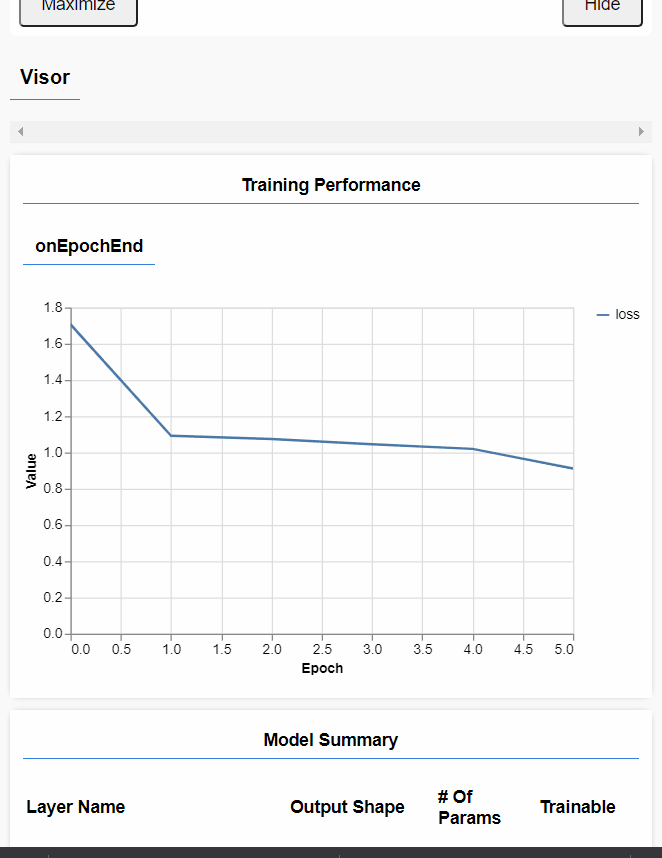
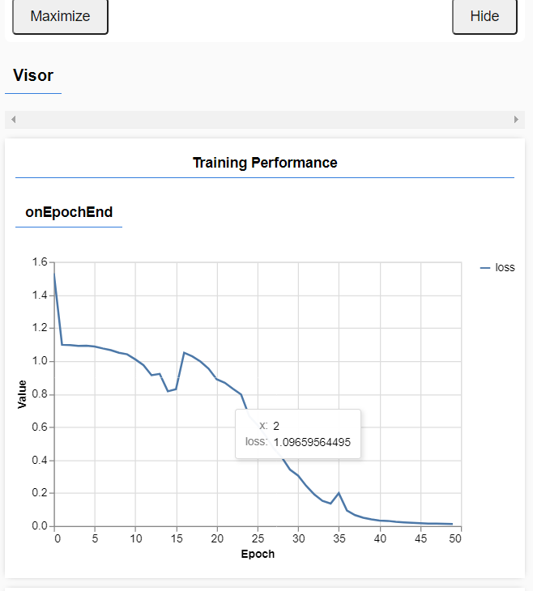

# TRIANGLES CIRCLES AND SQUARES

from : https://www.youtube.com/watch?v=3MqJzMvHE3E

See `generating_datasets` for how to get the pictures for training set

Then use `data/cruncher.py` for renaming

Now we need to actually train and create a model

Slow training:

But it is wrong it shows a circle a triangle

