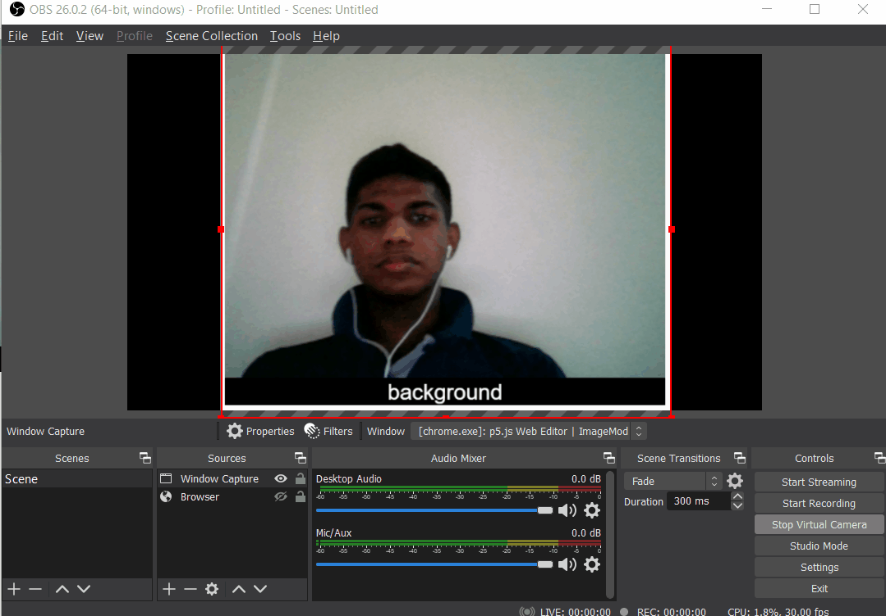

# Creating a text overlay for zoom

from coding train ! 
<https://www.youtube.com/watch?v=9z9mbiOZqSs&t=28s>

Steps :

1. Train a teachable machine model
2. Upload the model and use it on a p5 sketch
3. Start up obs studio and capture browser 
4. start virtual camera on OBS
5. use it on a zoom meeting

