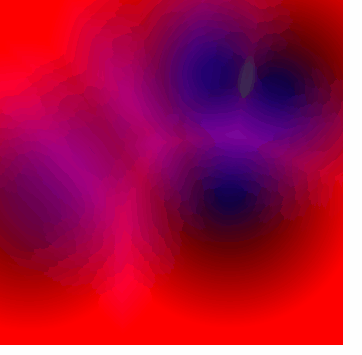
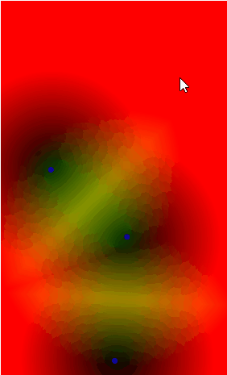

Proposed by somebone named worley, 
in this you simply have two step process to generate
noise

1. randomly distribute  anumber of points

2. for every pixel we calulate a distance to closest to the pixel, store all the numbers in an array

photosynthesis example:
https://editor.p5js.org/fanbyprinciple/full/aZGf5WRa6

