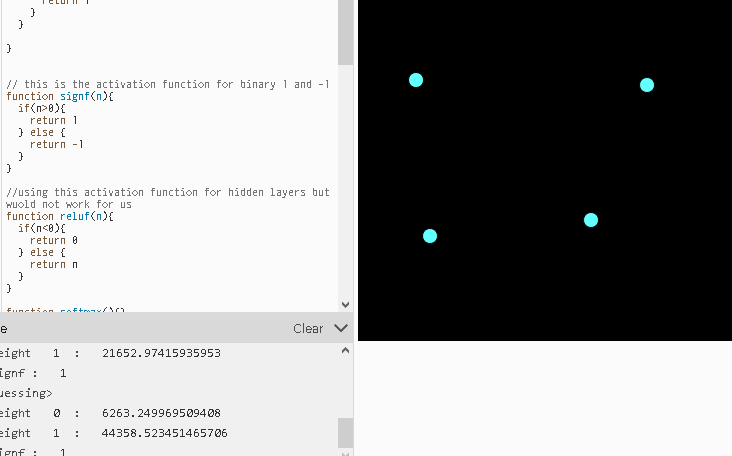

# Neural network qaudrant classifier

inspired by coding train of course:

https://editor.p5js.org/fanbyprinciple/sketches/0SbNVYvnX

Right now a bug with the weight initialiser:

Strangest error:
Even after updating the weight I am getting the value of array different than when getting the value indiidually.
