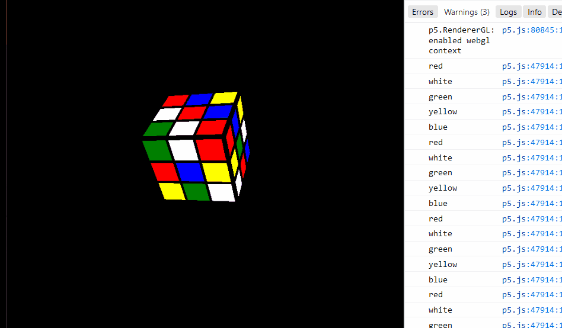

### Nature of Code 

Nature of Code (noc) is a book by Daniel shiffman, where he investigates natural phenomena using code, written entirely in processing. I wanted to try my hand at translating the code in processing to p5.js, even though an official trancompilation exists. 

This will include my attempts at additional modifications in the code also. So don't expect a code to code reference. Cheers!

P5.js is quite fun to be honest.

### Extra projects

This repository also contains a host of extra projects in p5.js that I took up from time to time most of them sourced from the coding train. Also by Daniel Shiffman.

Quirky and playful programming at its best.

I would like to complete the book though.

## More projects at @intandlearn

https://github.com/fanbyprinciple/intandlearn
