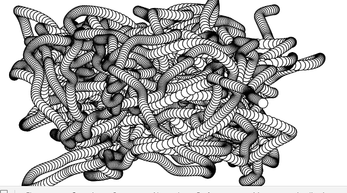

### Nature of Code 
Nature of Code (noc) is abook by Daniel shiffman, where he investigates natural phenomena using code, written entirely in processing. Though an official conversion of all th ecode to javascript exists. I wanted to try my hand at translating the code to p5.js. 

This will include my attempts at additional modificaations in the code also so don't expect a code to code reference. Cheers!

an example of weirdnes of p5.js:

Notes:
PENDING EXERCISES -
    1.4,1.5,ex-1.6,1.8,1.9,1.10